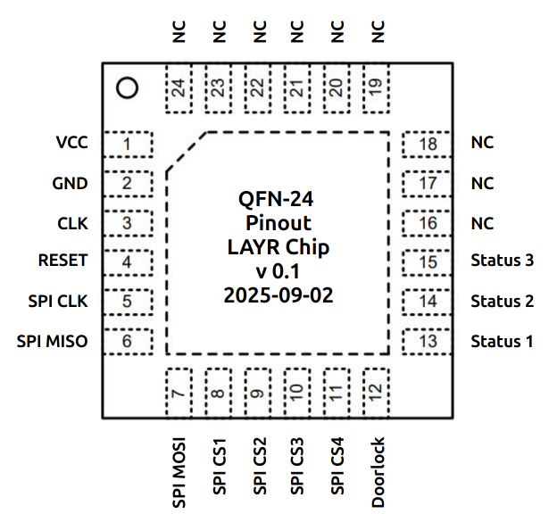

# LAYR: Chip specs / Datasheet

#### Description

Microchip for the LAYR. To be inserted into the HW-Kit.

#### Functionality

* Doorlock
* Security by design
* Verification 

#### Pins
| Name  | Function | IO |
|:----  | :----     | :---- |
| Pin1  | VCC       | Input |
| Pin2  | GND       | Input |
| Pin3  | CLK       | Input |
| Pin4  | Reset     | Input |
| Pin5  | SPI SCLK  | Output |
| Pin6  | SPI MISO  | Input |
| Pin7  | SPI MOSI  | Output |
| Pin8  | SPI CS1   | Output |
| Pin9  | SPI CS2   | Output |
| Pin10 | SPI CS3   | Output |
| Pin11 | SPI CS4   | Output |
| Pin12 | Doorlock  | Output |
| Pin13 | Status 1  | Output |
| Pin14 | Status 2  | Output |
| Pin15 | Status 3  | Output |

#### Packaging pinout
If QFN-24 is the packaging, this could be the pinout:

#### Packaging

* Package name:
  * **QFN-24** or QFN-32 or QFN-48   
* Package drawing

#### Clock / Reset

* Clockspeed: XXX MHz. 
* Reset is not inverted.

#### External components

* Memory Chip for Key Storage:
  * SPI-FLASH-2MB: GD25Q16 ???
  * [GD25Q16 datasheet](https://github.com/OCDCpro/WP5/blob/main/2025_demonstrator/Memorychip/GD25Q16_SPI_flash_2MB.pdf)
* NFC Reader:
  * RC522
  * [NXP MFRC522](https://www.nxp.com/docs/en/data-sheet/MFRC522.pdf)
* Doorlock (electronic-mechanical)
* Status Indicators (3 x LEDs)

#### Communication Interfaces

* SPI:
  * NFC Reader RC522
  * Memory Chip for Key Storage   
* Doorlock:
  * Pin high opens the door
* Status Indicators (LEDs):
  * Pin high lights the LED

#### Protocols

* OCDCpro Javacard Access Control Protocol (by Niklas Höher RUB / nhoeher) 

#### Example Schematics:

* HW-Kit LAYR (HSRM)

#### GDS

* Padframe, IO Pin Positions, Sealring (IHP ?)
 
