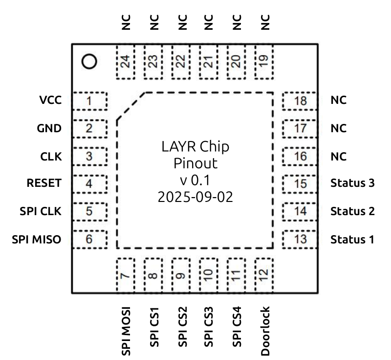

# LAYR: Chip specs / Datasheet

#### Description

Microchip for the LAYR. To be inserted into the HW-Kit.

#### Pins
| Name  | Function | IO |
|:----  | :----     | :---- |
| Pin1  | VCC       | Input |
| Pin2  | GND       | Input |
| Pin3  | CLK       | Input |
| Pin4  | Reset     | Input |
| Pin5  | SPI SCLK  | Output |
| Pin6  | SPI MISO  | Input |
| Pin7  | SPI MOSI  | Output |
| Pin8  | SPI CS1   | Output |
| Pin9  | SPI CS2   | Output |
| Pin10 | SPI CS3   | Output |
| Pin11 | SPI CS4   | Output |
| Pin12 | Doorlock  | Output |
| Pin13 | Status 1  | Output |
| Pin14 | Status 2  | Output |
| Pin15 | Status 3  | Output |

#### Functionality

* Doorlock
* Security by design
* Verification 

#### Packaging

* Package name:
  * **QFN-24** or QFN-32 or QFN-48   
* Package drawing

#### Clock / Reset

* Should run with XXX MHz. 
* Reset is not inverted.

#### External components

* Memory Chip for Key Storage:
  * To be defined 
* NFC Reader:
  * RC522

#### Communication Interfaces

* SPI:
  * NFC Reader RC522
  * Memory Chip for Key Storage   

#### Protocols

* OCDCpro Javacard Access Control Protocol (by Niklas Höher / nhoeher) 

#### Example Schematics:

* HW-Kit LAYR

#### GDS

* Padframe
* IO Pin Positions
* Sealring
